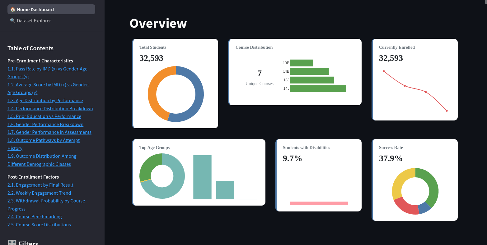

#  🎓 Open University Student Performance Analyzer



<p align="center">
  <a href="https://kaggle.com/your-dataset-link" target="_blank">
    
  </a>
</p>


<p align="center">
  <a href="https://computer-animation-project.streamlit.app/" target="_blank">
    
  </a>
  &nbsp;
  <a href="https://open-university-student-performance.onrender.com/" target="_blank">
    
  </a>
</p>


## 📌 Overview

This Streamlit application provides interactive visualizations of student performance data from the Open University. The dataset captures various factors influencing academic outcomes, including demographics, course details, and student engagement metrics.

## 📂 Dataset Information

The dataset consists of multiple CSV files stored in the `./data/` directory:

```
./data/
├── courses.csv          # Course/module information
├── assessments.csv      # Exam and assignment details
├── studentInfo.csv      # Student demographics and final results
├── studentVle.csv       # Virtual Learning Environment interactions
└── studentAssessment.csv # Student scores for assessments
```

**Key Features**:
- 32,593 student records
- 7 courses across 4 semesters
- Multiple assessment types (TMA, CMA, Exams)
- VLE engagement metrics (clicks, resource access)

## 🎯 Visualization Purposes

### 1. Demographic Analysis
**Purpose**: Understand how gender affects academic outcomes  
**Visualizations**:
- Interactive pie charts showing outcome distribution (Pass/Fail/Withdrawn/Distinction)
- Gender-filtered comparisons (Male/Female/All)

### 2. Performance Metrics
**Purpose**: Analyze assessment performance patterns  
**Visualizations**:
- Box plots of scores by assessment type (TMA/CMA/Exam)
- Outcome-based score distributions

### 3. Engagement Analysis
**Purpose**: Examine relationship between VLE usage and results  
**Visualizations**:
- Click activity vs. academic outcomes
- Engagement patterns across different result categories

## 🚀 Getting Started

### Prerequisites
```
python==3.8+
streamlit==1.22.0
pandas==1.5.0
plotly==5.11.0
```
### Running the Application
Easiest way is if you have `docker` ready:
```bash
docker run --rm -ti -p 0.0.0.0:8501:8501 yoniash/open_university_student_performance
```
Otherwise download the sources, follow the installation steps and then:
```bash
python -m streamlit run app.py
```

### Installation
1. Clone the repository:
```bash
git clone https://github.com/Yonathan-Ashebir/computer_animation_project.git
cd computer_animation_project
```

2. Install dependencies:
(for deployment purposes the poetry files is currently inside `_fix`) <!--todo fix-->
 ```bash
poetry install
```
```bash
pip install -r requirements.txt
```
The latter will install deployment dependencies only


3. Place dataset files in `./data/` or let the app attempt automatic download

## 🛠️ Technical Implementation

Key technical features:
- Automatic dataset verification and download
- Cached data loading for performance
- Responsive layout with tabbed navigation
- Interactive Plotly visualizations
- Comprehensive error handling

## 📊 Sample Insights

1. **Gender Differences**: Female students show 8% higher distinction rates
2. **Assessment Patterns**: Exam scores show strongest outcome differentiation

## 📜 License

This project uses the [Open University Dataset](https://www.kaggle.com/datasets/mohammadehsani/student-performance-at-open-university) under CC0: Public Domain license.

## 🤝 Contributing

This intended to be as a one time educational project but still contributions are welcome! Please open an issue or submit a pull request for any improvements.
